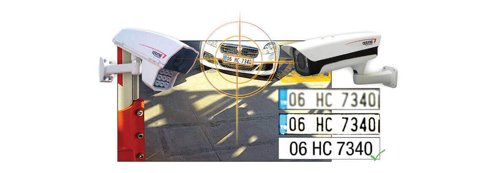
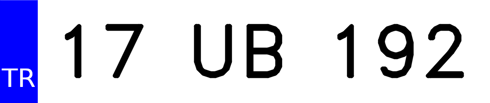

# License Plate Recognition

## Using a Convolutional Neural Network to recognize license plates

-----------------------------------------

1. background:
   1. Artificial Intelligence is quickly becoming part of every product or service we, as consumers, interact with.  AI is also making entirely new services and industries possible.
   2. Have you ever ordered or takeout during Covid-19?  Even though you've given your vehicle information, you still have to call the restaurant or blink your lights to let them know you're ready to pick-up.
   3. Now imagine a second scenario - you pull up in the parking lot, your license plate is recognized, the staff are notified you're ready to pick up your order, and either the staff or app can offer you your favorite sides, sauces, drinks, or even discount coupons based on your previous orders.
   
   4. Small businesses and franchise chains can add new features of acknowledging customers as well as gaining insight into customer loyalty.  Such insights can be used for individually tailored marketing, much like how your web browser provides a litany of information about your viewing and purchasing habits such as your favorite brands,
   5. Currently there is a huge cost for license plate reading solutions - small businesses can't take advantage

Detect and Recognize car license plates

use CNN (convolutional neural network) to read license plates

data description:
source - [Tolga Üstünkök, Atılım University, Turkey](https://www.kaggle.com/tustunkok/synthetic-turkish-license-plates) 

1. image processing:
   1. License Plate images
   2. 
   The dataset consists of 100,000 generated images of Turkish license plates and have pixel dimensions of (1025 x 218)
   license plates used 33 characters - 10 numbers and 23 letters (no Q, W, or X)
   The images are originally in color - represented by 3 color channels, Red Green, Blue (RGB)
   In terms of a numpy array, this translates into a shape of (100000, 218, 1025, 3)
   
   *image of grayscale* 
      1. ########################################
      2. thresholded  #####################################
      3. One of the first designs used a morphological operator, dilation, to smooth the thresholded images, but this also led to the system misidentifying "LA" as a single letter.
      4. so I opted to instead use an erosion, to increase the distance between letters, followed by a gaussian blur to smooth the edges.
      5. erosion  ##################################
      6. blurred  ##################################
      7.  
   1. contour detection
      1. 

2. model architecture:
   1. image of architecture #################
   2. While testing multiple architecture designs, I realized the models would very easily get to 100% accuracy for this generated dataset.  The final model for this phase of the project was selected for its simplicity, fast training time, and small size (< 3 MB) that could be deployed on mobile devices and web browsers.
   3. design
      1. image inputs (30, 30, 1)
      2. convolution kernel (4, 4) x 40 filters, no padding on images
         1. output (27, 27, 40)
      3. max pooling (sub-sampling)
         1. output (13, 13, 40)
      4. max pooling (sub-sampling)
         1. output (6, 6, 40)
      5. flatten
         1. (1440)
      6. dense neural network 20 relu
      7. dense neural network 33 softmax
   4. optimizer adam, loss categorical cross entropy
   5. total parameters: 30,193

3. model performance / size:
   1. the CNN was trained on grayscale images of size (30, 30)
   2. 20 images were batched and sent through the CNN for classification during a single epoch.
   3. After each epoch, the CNN would update each of the different feature maps' weights in order to improve its classification performance.
   4. This process repeated for 10 epochs total, as the model would quickly reach feature weights for > 90% accuracy within 4 epochs.

4. technology stack:
   1. python
   2. keras
   3. tensorflow
   4. opencv
   5. numpy
   6. scikit-learn
   7. matplotlib
   8. seaborn
   9. flake8

5.  installation:\

    1. how to git clone

    2. python scripts for setup.py

    3. where to put license plate images

Project Organization

-----------------------------------------

    ├── LICENSE
    ├── Makefile           <- Makefile with commands like `make data` or `make train`
    ├── README.md          <- The top-level README for developers using this project.
    ├── data
    │   ├── external       <- Data from third party sources.
    │   ├── interim        <- Intermediate data that has been transformed.
    │   ├── processed      <- The final, canonical data sets for modeling.
    |   └── raw            <- New unprocessed images for reading.
    │
    ├── docs               <- A default Sphinx project; see sphinx-doc.org for details
    │
    ├── models             <- Trained and serialized models, model predictions, or model summaries
    │
    ├── notebooks          <- Jupyter notebooks. Naming convention is a number (for ordering),
    │                         the creator's initials, and a short `-` delimited description, e.g.
    │                         `1.0-jqp-initial-data-exploration`.
    │
    ├── references         <- Data dictionaries, manuals, and all other explanatory materials.
    │
    ├── requirements.txt   <- The requirements file for reproducing the analysis environment, e.g.
    │                         generated with `pip freeze > requirements.txt`
    │
    ├── setup.py           <- makes project pip installable (pip install -e .) so src can be imported
    ├── src                <- Source code for use in this project.
    │   ├── __init__.py    <- Makes src a Python module
    │   │
    │   ├── data           <- Scripts to download or generate data
    │   │   └── make_dataset.py
    │   │
    │   ├── features       <- Scripts to turn raw data into features for modeling
    │   │   └── build_features.py
    │   │
    │   ├── models         <- Scripts to train models and then use trained models to make
    │   │   │                 predictions
    │   │   ├── predict_model.py
    │   │   └── train_model.py
    │   │
    │   └── visualization  <- Scripts to create exploratory and results oriented visualizations
    │       └── visualize.py
    │
    └── tox.ini            <- tox file with settings for running tox; see tox.readthedocs.io

-----------------------------------------

Further Reading:

1. Interactive - [Spot the Surveillance](https://www.eff.org/spot-the-surveillance/index-desktop.html)

2. Article - [Texas adds ALPR to toll roads](https://www.traffictechnologytoday.com/news/tolling/aplr-technology-to-be-deployed-across-texas-toll-road-network.html)

3. Article - [Large budget needed for ALPR systems](https://riverland-tech.com/alpr/lpr-lights-camerasmoke-and-mirrors/)

Acknowledgements:
1. image - [parking garage](https://www.traffictechnologytoday.com/wp-content/uploads/2019/09/Q-Free-Intrada-ALPR-graphic-702x336.png)
2. image - [street surveillance](https://www.eff.org/sls/tech/automated-license-plate-readers/faq)
3. image - [fixed ALPR](https://www.optima-engineering.com/en/products/controlled-access-systems/vehicle-recognition-systems/automatic-license-plate-recognition-system-alpr-100)

<small>Project based on the <a target="_blank" href="https://drivendata.github.io/cookiecutter-data-science/">cookiecutter data science project template</a>. #cookiecutterdatascience</small>

