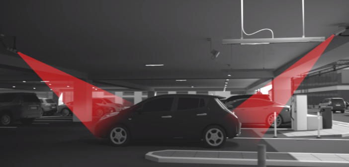
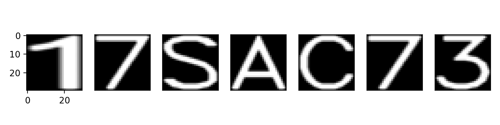

# License Plate Recognition

## Using a Convolutional Neural Network to recognize license plates

Author: Joseph Wilson

---

## Background

Artificial Intelligence is quickly becoming part of every product or service we, as consumers, interact with.  A.I. is also making entirely new services and industries possible.
Have you ever ordered or takeout during Covid-19?  Even though you've given your vehicle information, you still have to call the restaurant or blink your lights to let them know you're ready to pick-up.

Now imagine a second scenario - you pull up in the parking lot, your license plate is recognized, the staff are notified you're ready to pick up your order, and either the staff or app can offer you your favorite sides, sauces, drinks, or even discount coupons based on your previous orders.

Small businesses and franchise chains can add new features of acknowledging customers as well as gaining insight into customer loyalty.  Such insights can be used for individually tailored marketing, much like how your web browser provides a litany of information about your purchasing habits to every site you visit.

Currently there is a huge cost for license plate reading solutions that small businesses can't leverage. This is why most users of the technology involve Law Enforcement, Parking Garages, and Toll Roads.

---

## Data Description

The dataset consisted of 100,000 generated images of Turkish license plates and have pixel dimensions of (1025 x 218).  This dataset had been generated in order to address a lack of license plate from the state of Turkey.
The license plates used 33 characters - 10 numbers and 23 letters (no Q, W, or X).
The images were originally in color, represented by 3 color channels - Red, Green, Blue (RGB)  In terms of a data array, this translates into a data shape of (100000, 218, 1025, 3).

source - [Tolga Üstünkök, Atılım University, Turkey](https://www.kaggle.com/tustunkok/synthetic-turkish-license-plates)

## Image Processing

I first began by converting the images to grayscale to simplify the next transformations as well as reduce the data. For those following along, now our data array shape would be (100000, 218, 1025, 1).

A Threshold was then applied to increase contrast and strip away more obvious noise in the image.

One of the first designs used a morphological operator, dilation, to smooth the thresholded images, but this also led to the system misidentifying some characters as a single letter due to how large and fuzzy the characters became.

So I opted to instead use an erosion morphological operator, to increase the distance between letters.

Next was a gaussian blur to smooth and soften the image.

Finally the image was sent through a segmentation function that uses Contour Detection to identify shapes in the image.  Those shapes were then screened for obvious false-positives by area and proportions.

The segmentation allows the CNN to specialize in classifying each segment as one of the 33 characters, instead of the entire license plate at once.

What remained were the individual character segments, all reshaped to be a consistent (30 x 30) pixels in size (a general requirement for such a model to function).

As a result, the data array was transformed into a shape of (700000, 30, 30, 1).

## Convolusional Neural Network

While testing multiple architecture designs, I realized the models would very easily get to 100% accuracy for this generated dataset.  The final model for this phase of the project was selected for its simplicity, fast training time, and small size (< 3 MB) that could be deployed on mobile devices and web browsers.

### Design

This diagram is for illustrative purposes, as the CNN model for this phase of the project was able to be much simpler in size and complexity.

      1.  Input Character Segment
          - (30, 30, 1)
      2. 40 x Convolution layers
         - Kernel size (4, 4), no padding
         - output (27, 27, 40)
      3. Pooling (sub-sampling)
         - output (13, 13, 40)
      4. Pooling (sub-sampling)
         - output (6, 6, 40)
      5. Flatten
         - (1440)
      6. Dense Neural Network
         - 20 neurons 
         - relu activation
      7. Dense Neural Network 
         - 33 neurons
         - softmax activation

- Loss function being optimized: categorical cross entropy
  - This is used to calculate performance at each epoch
- Total Parameters: 30,193
  - the number of feature weights this network is tweaking in order to improve its performance classifying the characters
- Optimization Method: Adam
  - It uses both "gradient" as well as  "momentum" - it's simply the best optimizer to start with for general purposes

## Model Performance

20 images per batch were sent through the CNN for classification during a single epoch.
After each epoch, the CNN would update each of the weights for each feature map and neuron in order to improve its classification performance.
This process repeated for 10 epochs total, as the model would quickly reach necessary feature weights for > 90% accuracy within 5 epochs.

## Conclusion

This project was a long but fruitful success as far as building the first iteration of a license plate recognition package.  It is fully possible for new users to clone the repository, run the setup files and begin using the package to process and read license plate images.

However, more work is to be done to make the repository more accessible to the general open source community both for further developement as well as user experience.

- [x] CNN created and validated
- [x] flake8 compliant
- [ ] Documentation completed
- [ ] Pytest suite written
- [ ] Code refactoring review
- [ ] Pipeline rebuilt to process noisier images
- [ ] CNN rebuilt to classify variety of images

## Technology stack

   1. python
   2. opencv
   3. numpy
   4. keras
   5. tensorflow
   6. matplotlib
   7. flake8

## Getting Started

 1. `git clone https://github.com/Business-Wizard/License_Plate_Recognition.git`

 2. Move terminal to the newly made license_plate_recognition folder

 3. `pip install .`

 4. `pip install -r requirements.txt`

 5. Place new license plates into [license_plate_recognition/data/raw/](./data/raw/)

 6. Use the `predict_model.py` to make use of the pre-trained model or tweak the code to your purposes

Project Organization

---

    ├── LICENSE
    ├── Makefile           <- Makefile with commands like `make data` or `make train`
    ├── README.md          <- The top-level README for developers using this project.
    ├── data
    │   ├── external       <- Data from third party sources.
    │   ├── interim        <- Intermediate data that has been transformed.
    │   ├── processed      <- The final, canonical data sets for modeling.
    |   └── raw            <- New unprocessed images for reading.
    │
    ├── docs               <- A default Sphinx project; see sphinx-doc.org for details
    │
    ├── models             <- Trained and serialized models, model predictions, or model summaries
    │
    ├── notebooks          <- Jupyter notebooks. Naming convention is a number (for ordering),
    │                         the creator's initials, and a short `-` delimited description, e.g.
    │                         `1.0-jqp-initial-data-exploration`.
    │
    ├── references         <- Data dictionaries, manuals, and all other explanatory materials.
    │
    ├── requirements.txt   <- The requirements file for reproducing the analysis environment, e.g.
    │                         generated with `pip freeze > requirements.txt`
    │
    ├── setup.py           <- makes project pip installable (pip install -e .) so src can be imported
    ├── src                <- Source code for use in this project.
    │   ├── __init__.py    <- Makes src a Python module
    │   │
    │   ├── data           <- Scripts to download or generate data
    │   │   └── make_dataset.py
    │   │
    │   ├── features       <- Scripts to turn raw data into features for modeling
    │   │   └── build_features.py
    │   │
    │   ├── models         <- Scripts to train models and then use trained models to make
    │   │   │                 predictions
    │   │   ├── predict_model.py
    │   │   └── train_model.py
    │   │
    │   └── visualization  <- Scripts to create exploratory and results oriented visualizations
    │       └── visualize.py
    │
    └── tox.ini            <- tox file with settings for running tox; see tox.readthedocs.io

---

Further Reading:

1. Interactive - [Spot the Surveillance](https://www.eff.org/spot-the-surveillance/index-desktop.html)

2. Article - [Texas adds ALPR to toll roads](https://www.traffictechnologytoday.com/news/tolling/aplr-technology-to-be-deployed-across-texas-toll-road-network.html)

3. Article - [Large budget needed for ALPR systems](https://riverland-tech.com/alpr/lpr-lights-camerasmoke-and-mirrors/)

Acknowledgements:

1. image - [Parking Garage](https://www.traffictechnologytoday.com/wp-content/uploads/2019/09/Q-Free-Intrada-ALPR-graphic-702x336.png)

2. image - [Street Surveillance](https://www.eff.org/sls/tech/automated-license-plate-readers/faq)

3. image - [Fixed ALPR](https://www.optima-engineering.com/en/products/controlled-access-systems/vehicle-recognition-systems/automatic-license-plate-recognition-system-alpr-100)

4. image - [CNN diagram](https://miro.medium.com/max/3712/1*EPpYI-llkbtwHgfprtTJzw.png)

<small>Project based on the <a target="_blank" href="https://drivendata.github.io/cookiecutter-data-science/">cookiecutter data science project template</a>. #cookiecutterdatascience</small>

